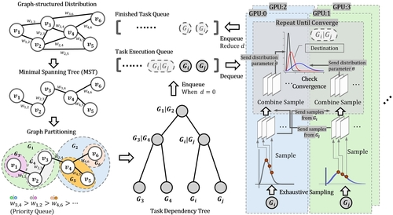

In areas such as molecular biology, computer vision, and natural language processing, graphs are commonly used to represent the structure of probability distributions (or their equivalents) that are too large to consider explicitly. In these settings, we are commonly interested in sampling from the distribution for various inference tasks. A typical approach is the use of Markov Chain Monte Carlo (MCMC) methods. The classic, uniprocessor, approach to MCMC still results in poor performance. While parallel approaches on CPU or GPU devices have been proposed, they are often designed for specific tasks and/or do not effectively utilize the inter-device communication capabilities of GPUs. We propose a novel, GPU-parallelizable MCMC method for this setting. Our approach makes use of a partitioning approach to divide the graph and dispatch the resulting sub-graphs to GPUs. Using the communication capabilities of GPUs (e.g., NVLink), we give a way to coordinate information between the computations over adjacent subgraphs and subsequently merge them. This approach takes advantage of the high degree of GPU parallelism while maintaining the generality of MCMC sampling. We demonstrate the performance of our approach for estimating protein conformational stability. Over four different benchmarks and two GPU platforms we show that our method achieves up to a 400% speedup over an adaptive Monte Carlo sampling method.

_Schematic of our approach._