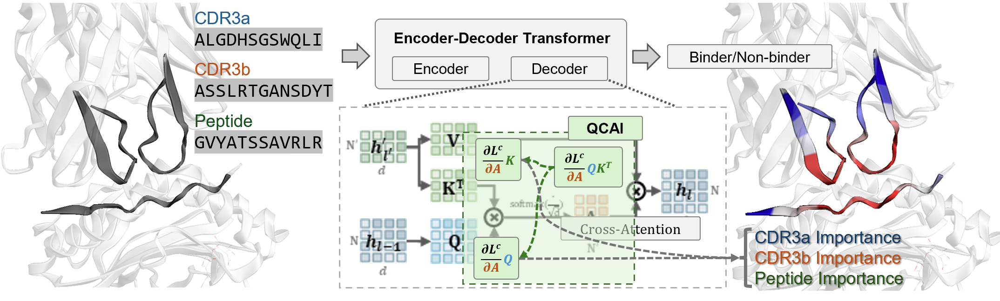

CD8+ killer T cells and CD4+ helper T cells play a central role in the adaptive immune system by recognizing antigens presented by Major Histocompatibility Complex (pMHC) molecules via T Cell Receptors (TCRs). Modeling binding between T cells and the pMHC complex is fundamental to understanding basic mechanisms of human immune response as well as in developing therapies. While transformer-based  models such as TULIP have achieved impressive performance in this domain, their black-box nature precludes  interpretability and thus limits a deeper mechanistic understanding of T cell response. 
Most existing post-hoc explainable AI (XAI) methods are confined to encoder-only, co-attention, or model-specific architectures and cannot handle encoder-decoder transformers used in TCR-pMHC modeling. To address this gap, we propose Quantifying Cross-Attention Interaction (QCAI), a new post-hoc method designed to interpret the cross-attention mechanisms in transformer decoders. Quantitative evaluation is a challenge for XAI methods; we have compiled TCR-XAI, a benchmark consisting of 274 experimentally determined TCR-pMHC structures to serve as ground truth for binding. Using these structures we compute physical distances between relevant amino acid residues in the TCR-pMHC interaction region and evaluate how well our method and others estimate the importance of residues in this region across the dataset. We show that QCAI achieves state-of-the-art performance on both interpretability and prediction accuracy under the TCR-XAI benchmark. 

_**Quantifying Cross-Attention Interaction (QCAI)** is a post-hoc explanation method designed for cross-attention mechanisms. In this paper, we show that QCAI enables insight into the structural basis for TCR-pMHC binding._

