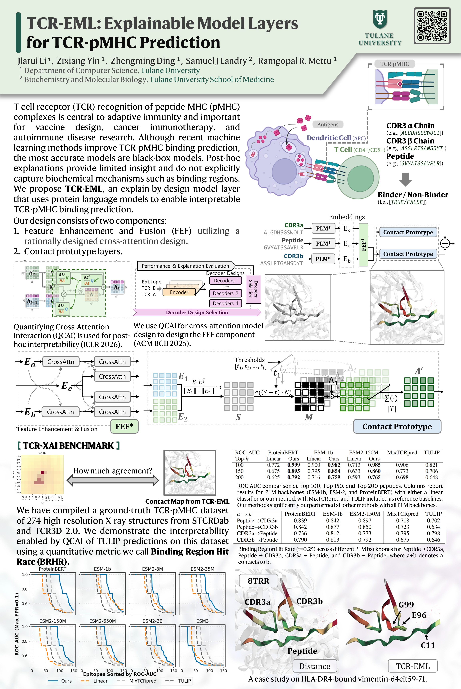

T cell receptor (TCR) recognition of peptide-MHC (pMHC) complexes is a central component of adaptive immunity, with implications for vaccine design, cancer immunotherapy, and autoimmune disease. While recent advances in machine learning have improved prediction of TCR-pMHC binding, the most effective approaches are black-box transformer models that cannot provide a rationale for predictions. Post-hoc explanation methods can provide insight with respect to the input but do not explicitly model biochemical mechanisms (e.g. known binding regions), as in TCR-pMHC binding. "Explain-by-design" models (i.e., with architectural components that can be examined directly after training) have been explored in other domains, but have not been used for TCR-pMHC binding. We propose explainable model layers (TCR-EML) that can be incorporated into protein-language model backbones for TCR-pMHC modeling. Our approach uses prototype layers for amino acid residue contacts drawn from known TCR-pMHC binding mechanisms, enabling high-quality explanations for predicted TCR-pMHC binding. Experiments of our proposed method on large-scale datasets demonstrate competitive predictive accuracy and generalization, and evaluation on the TCR-XAI benchmark demonstrates improved explainability compared with existing approaches.

_**Explainable Model Layers (TCR-EML)** include a Feature Enhancement and Fusion (FEF) block and contact prototype layers, which not only predict TCR-pMHC binding but also provide contact scores corresponding to contact distances. In the absence of experimental TCR-pMHC structures, the contact prototype illuminates TCR-pMHC binding patterns._

